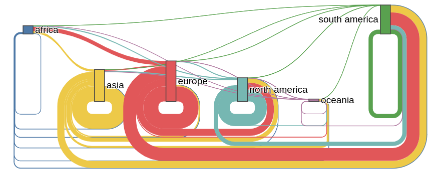
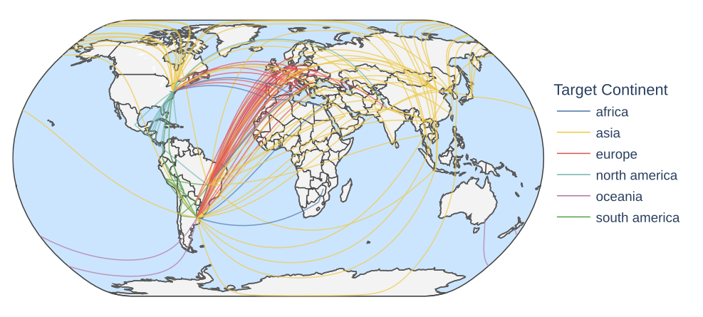
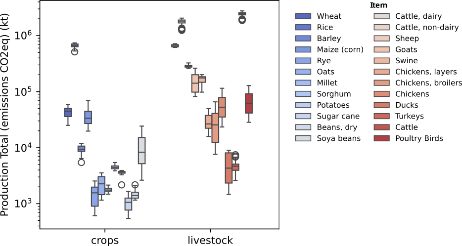
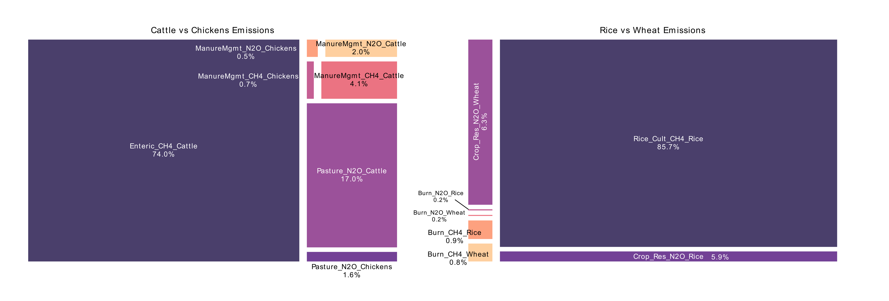
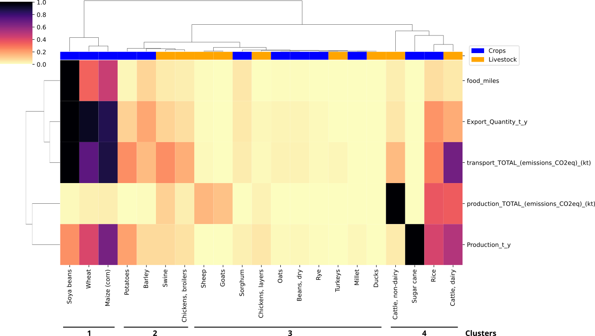
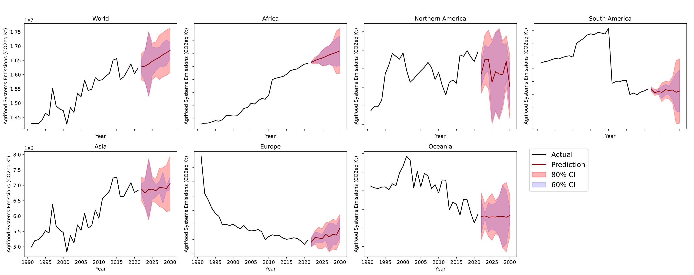
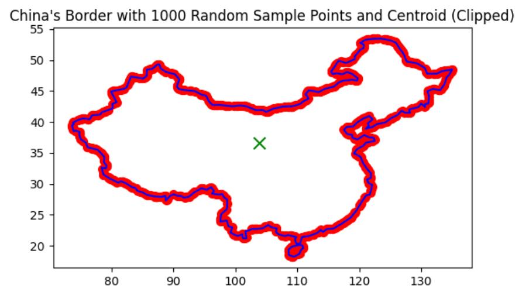

              

# Global Food Carbon Footprint Analysis - FAO

This document provides a comprehensive report on a data analysis project focused on the carbon footprint of food production and consumption. It covers the project's scope, methods, and findings, with an emphasis on data insights from the Food and Agriculture Organization (FAO) and various analytical approaches used.

## Objective

The objective of this project is to analyze the carbon footprint associated with global food production and consumption. Utilizing data from the FAO, the project aims to uncover insights into food emissions patterns and predict future trends through advanced data science techniques.

## Project Overview

- **Data Cleaning and Processing**: The dataset's size and historical scope presented significant challenges in ensuring consistency and completeness.

- **Transport Emissions Analysis**: This involved analyzing a large trading matrix to assess the environmental impact of food transportation.

- **Food Item Classification**: Hierarchical clustering was employed to classify food items based on emissions, consumption, and production patterns, revealing similarities and groupings among different food categories.

- **Forecasting Food Emissions**: Machine learning techniques, including the MLforecast library, were used to project future food emissions, identifying potential trends and intervention points.

- **Country Classification**: K-means clustering was applied to categorize countries based on emissions profiles, considering factors such as crop production and livestock. This analysis highlighted global patterns and similarities in food-related emissions.

## Project Structure

- **`00_raw_tables_explore/`**: Raw and preliminary data exploration.
- **`01_food_trading/`**: Notebooks and data related to the analysis of global food trading over the years.
- **`02_food_emissions/`**: Contains files for analyzing food emissions data.
- **`03_food_dataset_compiling/`**: Includes notebooks for compiling and preparing the food dataset.
- **`04_country_emissions/`**: Contains files related to analyzing and classifying country emissions profiles.

## Key Findings and Insights

### Global Food Miles: The Hidden Cost of International Cuisine

The analysis of food trading emissions over the years reveals several key patterns. Asia and Europe stand out as the largest importers, while North America and South America are the leading exporters. The trade flow generating the most emissions is between North America and Asia, underscoring the environmental cost of long-distance trade between these continents. However, imports into Europe from various regions around the world cumulatively contribute the most to global food transportation emissions, making Europe a major player in global food-related CO2 emissions.

    <b>2022 Food Trading Associated Emissions Between Continents</b>

    
     
    <a href="https://plotly.com/~ezemriv/7/" target="_blank">View Interactive 1986-2022 Version on Plotly</a>

A further analysis of food items' travel patterns shows that, overall, crops travel more extensively than livestock. Among them, **soya beans** stand out as the most transported food item according to the FAO data, generating **over 20,000 kilotonnes of CO2-equivalent GHG emissions per year**. This highlights the substantial environmental impact of transporting high-demand crops.

A connections map of soya trading highlights that the majority of these trade flows are directed towards Europe, further emphasizing the continent's role in driving global food transport emissions.

    <b>Soya Beans Top Contaminating Trades (2021)</b>

    
     
    <a href="https://plotly.com/~ezemriv/18/" target="_blank">View Interactive Version on Plotly</a>

### From Farm to Atmosphere: Food Production CO2 Emissions

Even though crops are the leading contributors to travel emissions, the analysis of food production emissions tells a different story. Emissions from livestock food items far exceed those from crops, with livestock emissions increasing at a rate of 2771.76 kilotonnes per year, compared to 408.02 kilotonnes per year for crops. Overall, livestock emissions are up to seven times higher than crop emissions. A boxplot of production emissions (log scale) illustrates that cattle products and their derivatives are the highest emitters, followed by rice, with both showing at least one order of magnitude higher emissions than other items within their respective food groups.

    <b>Crops vs Livestock Production Emissions (2021)</b>

    

To further understand the stark difference in emissions between cattle and chickens, I created two treemaps. The **left treemap** compares their respective emission components. The entire treemap represents the total summed emissions from cattle and chicken, with each section showing the proportional emissions contribution of each feature for these food items. It is clear that more than 90% of the total emissions stem from just two components of cattle emissions: **enteric fermentation (CH4)** and **pasture (N2O)**. Enteric fermentation in cattle produces large amounts of methane, a potent greenhouse gas, as part of their digestive process. Meanwhile, pasture management releases significant amounts of nitrous oxide due to manure left on the soil, contributing to N2O emissions. These biological processes in cattle production drive their much higher emissions compared to other livestock.

In the **right treemap**, I compare rice and wheat emissions. Over 85% of the combined emissions of the two are tied to the **rice cultivation** feature, which involves the inundation of rice fields, promoting methane emissions by anaerobic bacteria.

    

### Beyond Animal vs. Plant: FAO Food Items Classification

The hierarchical clustering analysis reveals that food items group into four distinct clusters, with surprising overlaps between crops and livestock. **Cluster 1**, featuring soybeans, wheat, and maize, stands out with high food miles, export quantities, and transport emissions, indicating these crops are shipped long distances. **Cluster 4**, including cattle and rice, shows the highest production-related CO2 emissions, highlighting the significant environmental impact of these food items. Conversely, crops and animals in **Clusters 2 and 3** display relatively lower environmental impacts. This clustering highlights the complex interplay between food production, trade, and environmental impact. For a detailed view, refer to the heatmap below.

    <b>Clustermap of Food Items with Environmental and Production Data</b>

    

### Forecasting the Global Appetite for Emissions

The world's agrifood systems have been leaving an increasingly heavy mark on our climate. My analysis shows that over the past two decades, global emissions from food production and distribution have surged by more than 10%, reaching a staggering **16.4 gigatons of CO2** in 2021. Recent years have seen this trend accelerate, with annual increases of 1.5% (excluding the anomalous COVID-19 period). While **farm gate emissions**, **land use change**, and **pre/post-production activities** all contribute to this total, it is the latter category that is driving the upward trend. A continental breakdown reveals **Asia** as the primary emitter due to intense farm gate and post-production activities. Looking ahead, the forecast through 2030 indicates continued growth globally, with Asia, Africa, and Europe being the primary drivers of this trend. This projection underscores the urgent need for targeted interventions in food systems to mitigate their climate impact.

    <b>Forecasted Agrifood Emissions by Region</b>

    

### Identifying the Culprits: A Carbon Based Country Classification

Evaluating total agrifood systems emissions per country highlights key contributors such as **China**, **the United States**, and **Brazil**. The k-means clustering analysis, focusing on emissions patterns from various components, identified six main clusters using the following features:

- **Farm Gate Emissions (CO2eq)**
- **Land Use Change Emissions (CO2eq)**
- **Pre and Post Production Emissions (CO2eq)**
- **Emissions from Crops (CO2eq)**
- **Emissions from Livestock (CO2eq)**

The clusters identified are:

- **Cluster 1: The Giant** – This cluster consists solely of **China**, due to its exceptionally high emissions across all components, setting it apart in scale.
- **Cluster 2: Major Emitters** – **The United States** and **India** fall into this cluster, showing high emissions across all components, though at lower levels than China.
- **Cluster 3: Deforestation Hotspots** – **Brazil**, **Congo**, and **Indonesia** are notable for high emissions from land use change, reflecting significant deforestation.
- **Cluster 4: Emerging Deforestation Frontiers** – Countries like **Bolivia**, **Peru**, and **Mozambique** show high emissions from land use change and are geographically close to those in Cluster 3.
- **Cluster 5: Big Agricultural Producers** – **Argentina**, **Australia**, and **Russia** are prominent for high farm-gate emissions, particularly from livestock production.
- **Cluster 6: Small and Medium Producers and Importers** – **Spain**, **Chile**, and **Portugal** are among the more than 100 countries in this cluster, which, while having lower emissions compared to others, still play a role in global emissions, often as importers of food products from countries in other clusters.

These clusters illustrate different aspects of emissions profiles and their implications for global agrifood systems.

    <b>Map of Country Clusters (2021 data)</b>

    

# Appendix

## FAO Data

The FAO dataset utilized in this project is one of the most extensive sources of global agricultural and food-related data. Key aspects include:

- Coverage of over 245 countries and territories, providing a global perspective.
- Data on more than 200 primary crops and livestock products, offering detailed insights into the agricultural sector.
- Inclusion of production, trade, food balance sheets, and emissions data, enabling multifaceted analysis.
- Historical depth extending back to 1961 for many indicators, supporting long-term trend analysis and robust forecasting.

## Data Preparation

### Food Trading

The food trading matrix from the dataset was extensive, requiring careful handling. Due to its size, I utilized Google Colab to process the data in chunks. Each row of the matrix represented a transaction of a food item between a pair of countries, including the year and transaction value.

- **Country Name Curation**: Country names were standardized to match those used in GeoPandas for geographic analyses.
- **Distance Calculation**: 
  - **International Distance**: Distances between country capitals were computed as a proxy for the distance between countries.
  - **Internal Distance**: For transactions where the origin and destination were the same country, I calculated the distance from the country centroid to various points along its borders using GeoPandas (Notebook 06).
  
  

    
  

  
  - **Geographic Classification**: Identified which countries are islands or surrounded by water to account for transportation constraints.
- **Transportation Method Assumptions**: Assumptions were made regarding transportation methods (air, land, or water) for each transaction, influencing emissions calculations. Detailed assumptions are documented in Notebook 05.

### Food Emissions

The food emissions data were processed in folders 02 and 03. The goal was to create a comprehensive dataset with relevant emissions features. The key steps involved in preparing the data included:

- **Data Processing**: Raw data containing information about various food emissions were cleaned and transformed to create a consolidated dataset.
- **Representative Emissions Features**: The final dataset includes several emission-related features, such as:
  - `"Burning_crop_residues_(Emissions_N2O)_(kt)"`
  - `"Crops_total_(Emissions_CH4)_(kt)"`
  - `"Rice_cultivation_(Emissions_CH4)_(kt)"`

- **CO2 Equivalent Transformation**: Emissions data for CH4 and N2O were converted to CO2 equivalent emissions to standardize and simplify the analysis. This transformation allows for a more consistent comparison of different types of emissions.

- **Additional Features**: Besides emissions-related features, the dataset was augmented with non-emissions related features to provide a more comprehensive view of food production and consumption. Some additional features were:
  - `"Food supply quantity (tonnes)"`
  - `"Area harvested"`
  - `"Export Quantity"`

- **Trading Emissions Features**: Emissions calculated for trading were also added to the dataset for use in analysis and clustering.

Through this extensive processing, the dataset was consolidated into two main columns of emissions:
- `'production_TOTAL_(emissions_CO2eq)_(kt)'`
- `'transport_TOTAL_(emissions_CO2eq)_(kt)'`

These columns represent the total emissions from production and transportation, respectively, and are central to the subsequent analysis and clustering.

### Region and Country Emissions

For the analysis of regional and country-specific emissions, a total emissions table was utilized. This table included CO2 equivalent transformed emissions for various features. Key steps in preparing this data included:

- **Data Processing**: The total emissions table was processed to consolidate and clean data for accurate analysis.
- **Representative Emissions Features**: The dataset included CO2 equivalent emissions for several features, such as:
  - `'Crop Residues'`
  - `'Rice Cultivation'`
  - `'Enteric Fermentation'`
  - `'Manure Management'`
  - `'Forest fires'`

- **Data Merging and Curation**: The emissions data were merged and curated with additional FAO tables containing information on:
  - Population
  - GDP
  - GDP per capita
  - Country area

- **Total and Partial Emissions Columns**: The final total emissions column, which summed all components, was obtained alongside specific partial emissions columns.
  - **Partial Columns**:
    - `'Farm_gate_Emissions_(CO2eq)_(AR5)_kt'`
    - `'Land_Use_change_Emissions_(CO2eq)_(AR5)_kt'`
    - `'Pre-_and_Post-_Production_Emissions_(CO2eq)_(AR5)_kt'`
  - **Total Column**:
    - `'Agrifood_systems_Emissions_(CO2eq)_(AR5)_kt'`

## Practical Application: Web App for Food Origin and Environmental Impact Estimation

A practical application of this analysis is demonstrated in a Dockerized Flask web app, which predicts the origin of your food and estimates the environmental impact of its transportation based on the data analyzed in this repository.

The app allows users to input their location and food item, providing insights into:
- The probable country of origin for the food.
- The CO2 emissions generated from its transportation.

You can check out the web app and its repository here:

  